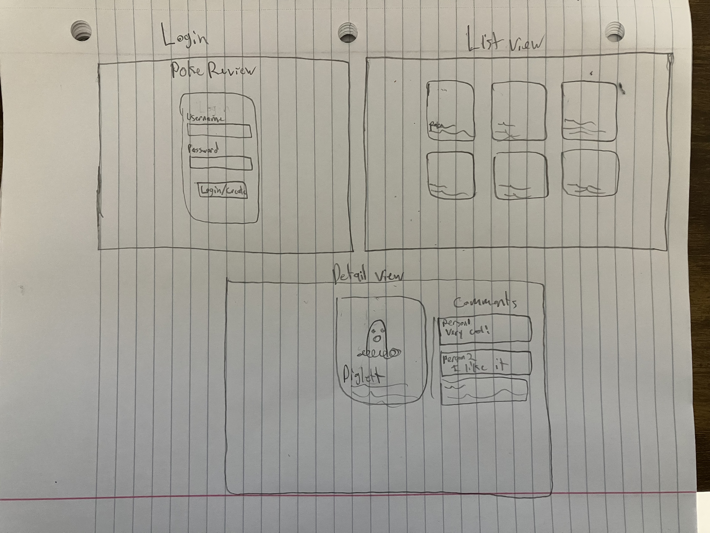

# PokeReview
CS 260 Startup project

## Elevator Pitch
The PokeReview site allows Pokemon enthusiasts to discuss their favorite Pokemon with others. 
View, Favorite, and comment on any of the original Pokemon.

## Key Features
- Account Creation / Login
- View a List of Pokémon
- Comment on any Pokemon
- Read others comments

## Technology description
- HTML - Uses correct HTML structure for application. Page for login, page for list view, page for pokemon details and comments.
- CSS - Application styling that looks good on different screen sizes, uses good whitespace, color choice and contrast.
- JavaScript - Provides login, list of pokemon, applying comments, display other users comments, backend endpoint calls.
- React - Single page application with views componentized and reactive to user's actions.
- Service - Backend service with endpoints for:
  - retrieving comments
  - submitting comments
  - get pokemon data from https://pokeapi.co/
- DB/Login - Store users and comments in database. Register and login users. Credentials securely stored in database. Can't comment unless authenticated.
- WebSocket - When a new comment is made, all users are notified

## Design

## HTML Deliverables
  - HTML Pages: Three different pages. One for each view. index.html(login), pokelist.html, pokeDetail.html
  - Proper HTML element usage: I used all the right tags as I already am familiar with html
  - Links: there are links between views
  - Text: there is some example/placeholder text for things
  - Placeholder for 3rd party service calls - The list page will be generated from a 3rd party service call as well as the poke detail page
  - Images: Image is displayed on pokeDetail page
  - Login placeholder, including user name display: The login placeholder is on the index.html page
  - Database data placeholder showing content stored in the database: Comments are on the pokedetail which will be stored in the database
  - WebSocket data placeholder showing where realtime communication will go: There is a comment section where users can post and see other comments

